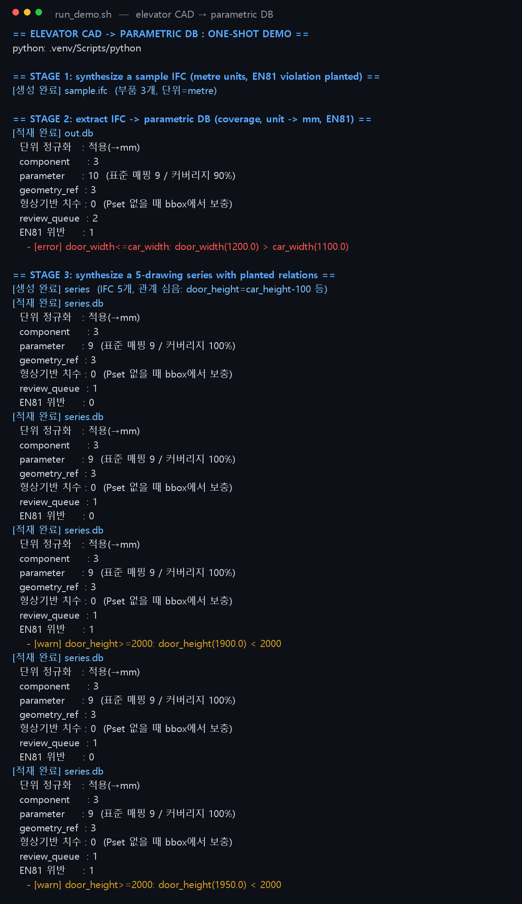
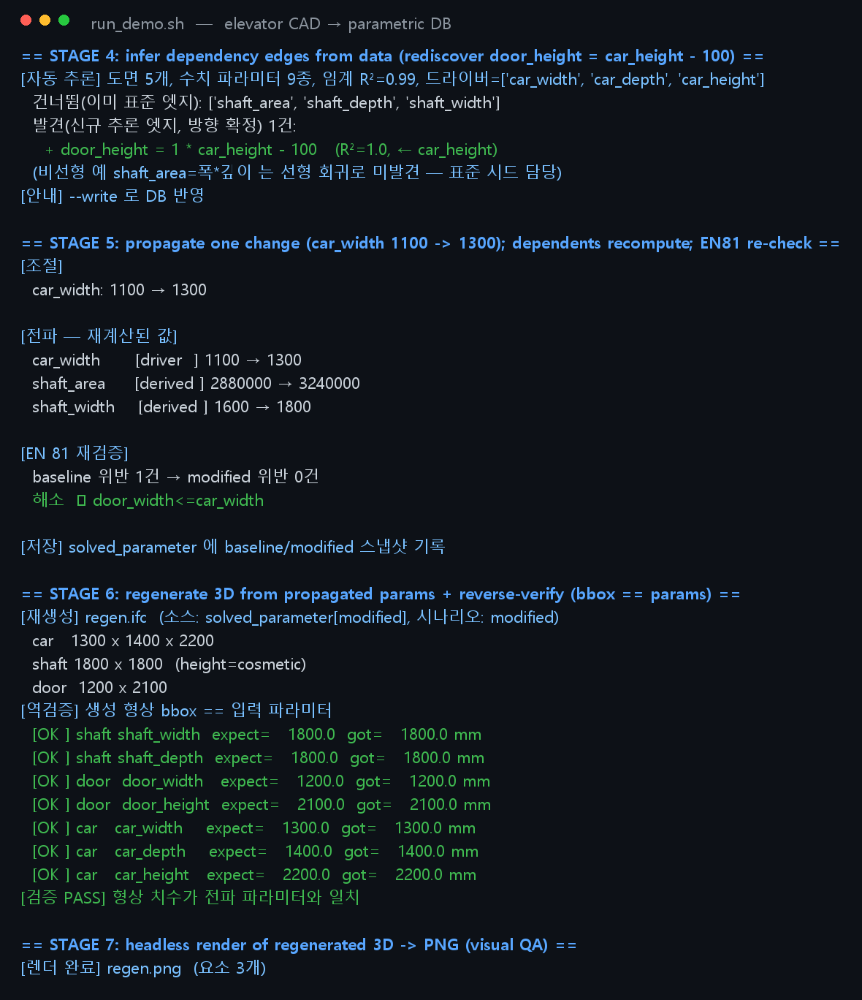
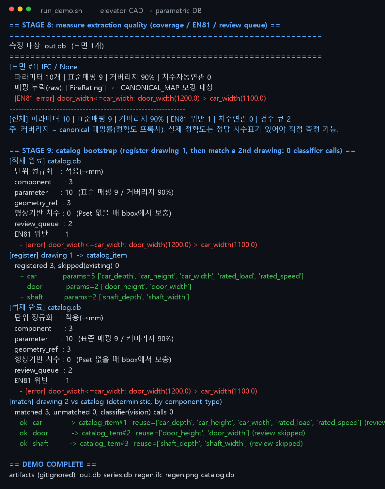
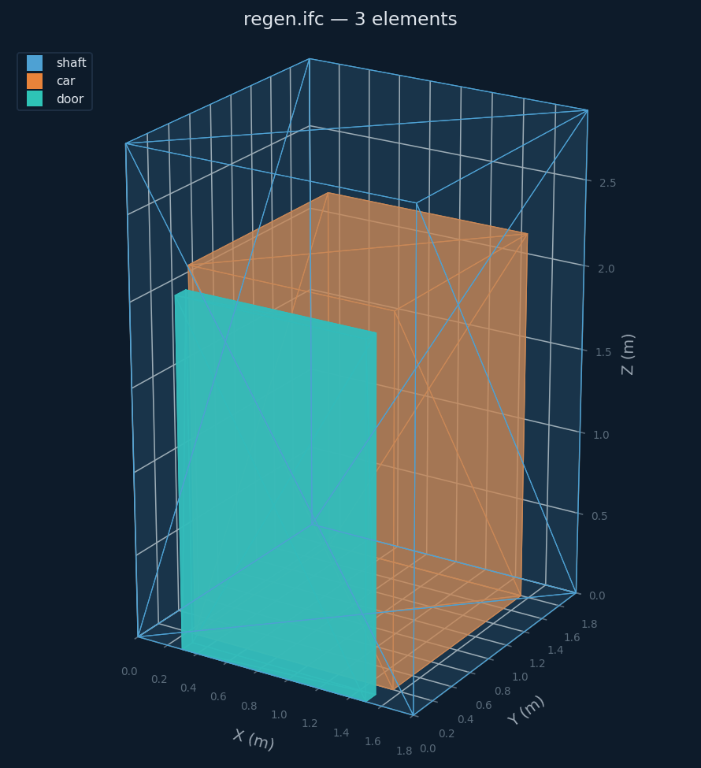

# 엘리베이터 CAD → 파라메트릭 DB · 전체 파이프라인 프로토타입

> **CAD 도면(IFC·DXF)을 "그림"이 아니라 부품·파라미터·의존 그래프로 적재하고,
> 치수 하나를 바꾸면 전체가 재계산되어 3D 형상까지 재생성하는 파이프라인.**
> 측정값은 불변, 솔버·재생성 결과는 분리 저장. "그림(B-rep)"은 저장하지 않고 `geometry_ref`로 참조.
> Pure Python · IfcOpenShell · ezdxf · EN81 검증 내장 · pytest + GitHub Actions CI

---

## 📸 한 번에 도는 데모 (`bash run_demo.sh`)

아래는 합성·표준 픽스처로 **추출 → 자동추론 → 전파 → 재생성 → 측정 → 카탈로그**까지
한 번에 도는 실제 실행 출력입니다. (이미지는 `docs/demo/`, 모두 재현 가능)

| STAGE 1–3 · 추출 / 시리즈 생성 | STAGE 4–7 · 추론 / 전파 / 재생성 |
|:---:|:---:|
|  |  |

| STAGE 8–9 · 측정 / 카탈로그 부트스트랩 | 재생성 3D (regen.ifc, headless render) |
|:---:|:---:|
|  |  |

---

## 핵심 아이디어

제조사 엘리베이터 도면은 보통 **"그림"** 으로만 다뤄집니다 — 치수 하나를 바꾸면
연관된 모든 값을 사람이 손으로 다시 계산해야 하고, 표준(EN81) 위반은 뒤늦게 발견됩니다.

이 프로젝트는 도면을 **파라메트릭 모델**로 끌어올립니다:

1. **추출(extract)** — 도면 → 부품·파라미터·형상참조. 단위 정규화(m→mm), 표준 Pset 매핑, EN81 검증.
2. **자동추론(infer)** — 여러 도면에서 파라미터 간 **선형 관계를 데이터만으로 재발견**.
3. **전파(propagate)** — 드라이버 치수 1개를 바꾸면 의존 그래프를 따라 **전부 재계산** + EN81 재검증.
4. **재생성(regen)** — 전파된 파라미터로 **3D 형상을 다시 만들고**, 생성된 bbox가 입력 파라미터와 같은지 **역검증**.
5. **측정(measure)** — 추출 품질(커버리지·EN81 위반·검수 큐)을 도면별/전체로 집계.
6. **카탈로그(catalog)** — 한 번 분류한 도면을 등록해두면, 같은 형식의 2번째 도면은 **비전 AI 호출 0회**로 결정론 재매핑.

핵심 원칙: **측정값은 불변이고, 솔버 결과(`solved_parameter`)는 별도 스냅샷으로 분리**합니다.
원본 추출값을 덮어쓰지 않으므로 baseline ↔ modified 를 언제든 비교·롤백할 수 있습니다.

---

## 파이프라인 개요

```
            IFC / DXF 도면
                  │  extract_ifc.py / extract_dxf.py
                  │  (단위정규화 →mm · 표준 Pset 매핑 · 형상 bbox 보충 · EN81 검증)
                  ▼
        ┌──────────────────────────────────────────┐
        │           파라메트릭 DB (schema.sql)        │
        │  parameter · component · geometry_ref      │
        │  dependency_edge · validation_issue        │────────────┐
        └──────────────────────────────────────────┘            │ measure.py
                  │                                              │ (커버리지·EN81·검수큐)
                  │  infer_edges.py  (여러 도면 OLS 회귀)         ▼
                  ▼                                          품질 리포트
        의존 그래프  (방향 모호 → review_queue, 사람 확인)
                  │
                  │  propagate.py  (드라이버 1개 조절 → 전파 + EN81 재검증)
                  ▼
        solved_parameter  (baseline / modified 스냅샷)
                  │
                  │  regen_ifc.py  (3D 형상 재생성 + bbox == params 역검증)
                  ▼
        regen.ifc ──→ render_ifc.py (headless) ──→ regen.png  (visual QA)

        catalog.py : 도면 1 등록 → 도면 2 결정론 매칭 (classifier 비전 호출 0회)
        classifier.py : 규칙기반 + 비전(VLM/YOLO) stub — 동일 인터페이스 시임
```

---

## 데모 STAGE 별 요약

| STAGE | 내용 | 검증된 결과 |
|:---:|------|------|
| 1 | metre 단위 + EN81 위반을 심은 샘플 IFC 합성 | `sample.ifc` (부품 3개) |
| 2 | IFC 추출 → 파라메트릭 DB | m→mm 정규화, 커버리지 90%, **EN81 위반 검출** (`door_width > car_width`) |
| 3 | 관계를 심은 5개 도면 시리즈 합성·적재 | `door_height = car_height − 100` 등 |
| 4 | **의존 엣지 자동 추론** | 심은 관계를 데이터만으로 **R²=1.0 재발견**, 비선형/표준 엣지는 시드 위임 |
| 5 | 전파 (`car_width 1100→1300`) | `shaft_width 1600→1800`, `shaft_area 2.88M→3.24M` 연쇄, **EN81 위반 1→0 해소** |
| 6 | 전파 결과로 3D 재생성 + 역검증 | 생성 형상 bbox **== 입력 파라미터, 7/7 OK PASS** |
| 7 | headless 3D 렌더 | `regen.png` (요소 3개) |
| 8 | 추출 품질 측정 | 커버리지·EN81·검수 큐 집계 + 매핑 누락(raw) 표면화 |
| 9 | 카탈로그 부트스트랩 | 도면 1 등록 → 도면 2 매칭 **3/3, 비전 호출 0회** |

---

## 구성 파일

| 파일 | 역할 |
|------|------|
| `paramdb.py` | 공통 코어 — 스키마·표준 사전·매핑·단위 정규화·EN81 검증·표준 상수 |
| `schema.sql` | 스키마 (`parameter`·`dependency_edge`·`validation_issue`·`constant`·`solved_parameter` 등) |
| `classifier.py` | 도면 분류 **AI 연결 시임** — 규칙기반 + 비전(VLM/YOLO) stub (동일 인터페이스) |
| `extract_ifc.py` | IFC 추출 — 표준 `Pset_TransportElementElevator`(ClearWidth/Depth/Height) + **형상 bbox 치수 보충** |
| `extract_dxf.py` | DXF 추출 — 블록→부품, 라벨→파라미터, **$INSUNITS 단위 + DIMENSION 자동연관** |
| `infer_edges.py` | **의존 그래프 자동 추론** — 여러 도면에서 선형 관계 회귀 발굴 (순수 파이썬 OLS) |
| `propagate.py` | 전파 솔버 — 드라이버 조절 → 의존 그래프 재계산 + EN81 재검증 |
| `regen_ifc.py` | 3D 재생성 — 전파 파라미터 → IFC 3D 형상(카·승강로·도어) + 역검증 |
| `render_ifc.py` | headless 3D 렌더 (visual QA용 PNG) |
| `measure.py` | 정확도/커버리지 측정 하니스 |
| `catalog.py` | 카탈로그 부트스트랩 (등록·결정론 재매칭) — 자세히는 [`CATALOG.md`](CATALOG.md) |
| `make_sample_ifc.py` · `make_sample_dxf.py` · `make_series_ifc.py` | 테스트 픽스처 생성기 |
| `tests/` · `.github/workflows/ci.yml` | pytest로 코어 IFC 루프 수치 고정 + GitHub Actions CI |

---

## 실행

### 한 번에 전체 데모

```bash
bash run_demo.sh        # STAGE 1~9 (위 스크린샷 그대로 재현)
```

### 단계별 직접 실행

```bash
pip install -r requirements.txt    # ifcopenshell, ezdxf 등

# 단일 도면: 추출 → 전파 → 3D 재생성
python make_sample_ifc.py sample.ifc
python extract_ifc.py sample.ifc out.db
python propagate.py out.db --set car_width=1300 --write
python regen_ifc.py out.db regen.ifc --scenario modified

# DXF (단위 + 치수 자동연관)
python make_sample_dxf.py sample.dxf && python extract_dxf.py sample.dxf dxf.db

# 여러 도면 → 의존 관계 자동 추론
python make_series_ifc.py series --n 5
for f in series/series_*.ifc; do python extract_ifc.py "$f" series.db; done
python infer_edges.py series.db                                                  # 방향 불확정은 사람 확인
python infer_edges.py series.db --drivers car_width,car_depth,car_height --write # 방향 확정 자동 기록

# 추출 품질 측정
python measure.py series.db
python measure.py new.db --ifc 제조사도면.ifc      # 실제 파일 투입 시 그 기준 수치
```

---

## 설계상의 정직한 한계

**의존 그래프 자동 추론.**
회귀는 **상관**만 본다 → 인과 **방향**을 못 정한다(`door_height=car_height-100` 과 그 역이 둘 다 R²=1).
방향이 모호하면 자동 기록하지 않고 **사람 확인(review)** 으로 보낸다(잘못된 방향 기록 = 모델 오염).
도메인 지식(`--drivers`)을 주면 방향이 풀려 자동 기록된다. 비선형(`shaft_area=폭*깊이`)은 선형 회귀로 미발견 → 표준 시드가 담당.

**분류 AI 시임 (`classifier.py`).**
구조화 도면은 규칙기반으로 충분. 스캔/레거시는 비전 AI(VLM/YOLO)가 필요하나 이 환경엔 모델 가중치가 없어
**stub + 동일 인터페이스**로 자리만 둔다(가짜 추론 없음). 실모델을 끼우면 파이프라인 변경 없이 교체된다.
부트스트랩: 비전 AI 1회 분류 → 카탈로그 등록 → 이후 결정론 처리(STAGE 9).

**실데이터 준비도.**
이 샌드박스에선 제조사 프로프라이어터리 도면을 받을 수 없어(포털/LFS/인증 차단) 합성·표준 픽스처로 검증한다.
대신 **공개 IFC 표준에 정합**시켜, 실제 표준 준수 파일이 들어오면 바로 매핑되게 했다:
- 표준 `Pset_TransportElementElevator` 속성명(`ClearWidth`·`ClearDepth`·`ClearHeight`)을 사전에 반영.
- 치수가 Pset에 없고 **형상에만 있는 실제 IFC**도 bbox에서 치수 추출(IFC 표준상 형상이 치수 우선).
- 낯선 제조사 표기는 `measure.py`로 누락을 표면화 → `CANONICAL_MAP` 보강 → 재측정으로 커버리지 상승.

> 주: 데모의 **커버리지 = canonical 매핑률**(정확도 프록시)이다. 실제 정확도는 정답 치수표가 있어야 직접 측정 가능하며,
> 제조사 파일을 올리면 `python measure.py new.db --ifc 도면.ifc` 로 그 파일 기준 수치가 나온다.

---

## 디렉토리 구조

```
erp/
├── run_demo.sh              ← STAGE 1~9 원샷 데모
├── paramdb.py · schema.sql  ← 코어 + 스키마
├── extract_ifc.py · extract_dxf.py
├── infer_edges.py · propagate.py · regen_ifc.py · render_ifc.py
├── measure.py · catalog.py · classifier.py
├── make_*_ifc.py · make_sample_dxf.py     ← 픽스처 생성기
├── tests/                   ← pytest (코어 루프 수치 고정)
├── .github/workflows/ci.yml ← GitHub Actions CI
├── docs/
│   ├── demo/                ← 데모 스크린샷 (재현 가능)
│   ├── renders/            ← 3D 렌더
│   └── design.pdf          ← 설계 문서
├── CATALOG.md              ← 카탈로그 부트스트랩 설명
└── 시연-대본.md            ← 데모 내레이션
```

---

## 다음 단계

- 실제 제조사 `.ifc/.dxf` 투입 → `measure.py` 로 진짜 정확도 수치 산출
- 비전 분류기 실모델 연결(별도 GPU 환경) — `classifier.py` 인터페이스에 맞춰
- 전파 결과 3D를 IFC 뷰어/Revit 렌더로 검수
